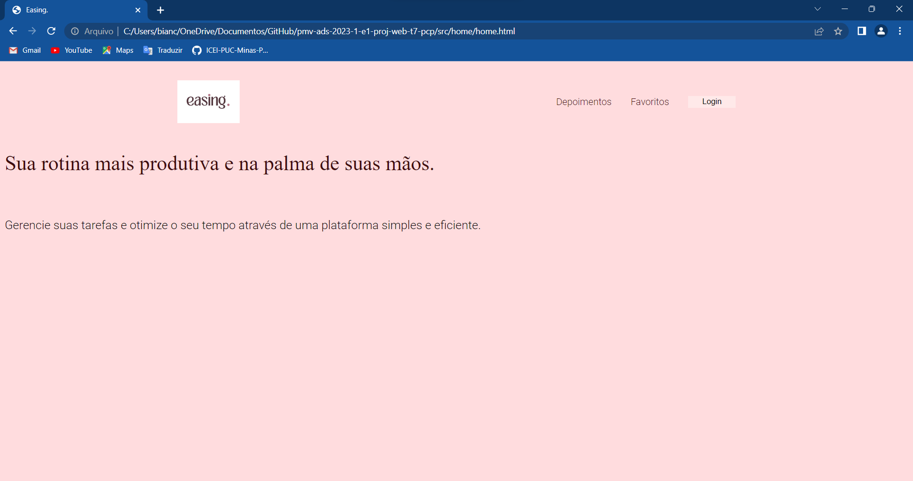
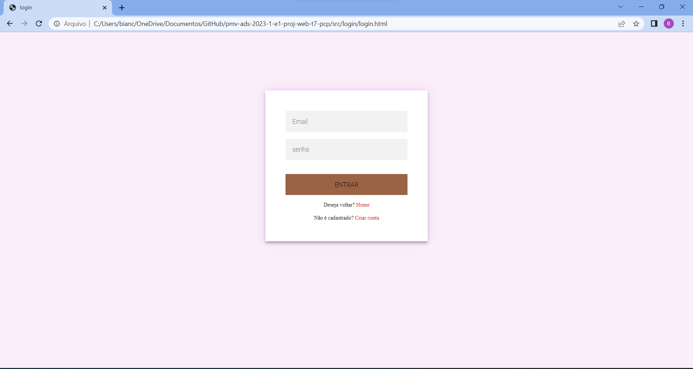
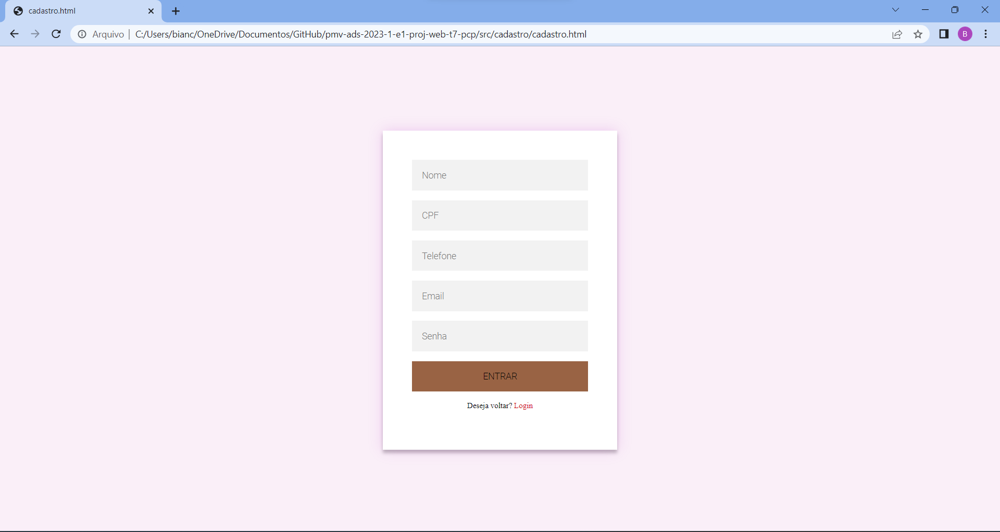

# Programação de Funcionalidades

Pré-requisitos: <a href="2-Especificação do Projeto.md"> Especificação do Projeto</a>, <a href="3-Projeto de Interface.md"> Projeto de Interface</a>, <a href="4-Metodologia.md"> Metodologia</a>, <a href="3-Projeto de Interface.md"> Projeto de Interface</a>, <a href="5-Arquitetura da Solução.md"> Arquitetura da Solução</a>

Implementação do sistema descritas por meio dos requisitos funcionais e/ou não funcionais. Deve relacionar os requisitos atendidos os artefatos criados (código fonte) além das estruturas de dados utilizadas e as instruções para acesso e verificação da implementação que deve estar funcional no ambiente de  .

Para cada requisito funcional, pode ser entregue um artefato desse tipo

- ## Tela home 

A tela principal mostra a apresentação do site. A tela tambem mostra a opção de login, depoimentos e favoritos.

 - **requisitos atendidos**

    **RF_001**

- ## Artefatos da funcionabilidade
 **index.html**
 **home.html**
 **style.css**

 
- ## instruções de acesso
 1. Clique no botão no canto superior direito da tela indicado como login
 2. Preencha as informações de acordo com o solicitado pelo site (Nome, Email, Senha e Confirme Senha), se não for cadastrado, vá na apção de cadastro

 
- ## Estrutura de dados

<!DOCTYPE html>
<html lang="pt-BR">
<head>
    <meta charset="UTF-8">
    <meta http-equiv="X-UA-Compatible" content="IE=edge">
    <meta name="description" content="A plataforma que irá tornar a sua vida mais facil na confeitaria.">
    <meta name="viewport" content="width=device-width, initial-scale=1.0">
    <title> Easing. </title>
    <link rel="stylesheet" type="text/css" href="./src/home/style.css">
</head>
<body>
    <header class= "cabeçalho">
      
         <nav class="cabeçalho-menu">
             <a class="cabeçalho-menu-item"> Depoimentos</a>
             <a class="cabeçalho-menu-item"> Favoritos</a>
             <a class="cabeçalho-menu-item" href="./src/login/login.html">Logar</a>
         </nav>
    </header>
    <main class="conteudo"> 
              

                 <h1 class="conteudo-principal-escrito-titulo"> Sua rotina mais produtiva e na palma de suas mãos.</h1>
                 <h2 class="conteudo-principal-escrito-subtitulo"> Gerencie suas tarefas e otimize o seu tempo através de uma plataforma simples e eficiente.</h2>
             

    </main> 
</body>
</html>

- ## Tela de login e cadastro
A tela de login permite ao usuário já cadastrado ter acesso a suas informações pessoais e a funcionalidades do site disponíveis apenas para os que já possuam login. Se nao for cadastrado, oferece a opção de cadastrar

 - **requisitos atendidos**
 
 - **Rf-02**

 - ## Artefatos da funcionabilidade

 **login.html**
 **style.css**
 **login.js**

- ## Estruturas de dados 

<!DOCTYPE html>
<html lang="pt-br">
  <head>
    <meta charset="UTF-8">
    <meta http-equiv="X-UA-Compatible" content="IE=edge">
    <meta name="viewport" content="width=device-width, initial-scale=1.0">
    <link rel="stylesheet" href="style.css">
    
    <title>login</title>
  </head>
  <body>

    

      

        <form id="frmCadastro">
          <input type="text" placeholder="Email" id="email"/>
          <input type="password" placeholder="senha" id="senha"/>
        </form>
        

        <button type="submit" id="btnLogar">Entrar</button>
        
Deseja voltar? <a href="../../index.html"> Home </a>

        
Não é cadastrado? <a
            href="../cadastro/cadastro.html"> Criar conta</a>

      

    

    <table id="tblListar">

    </table>
    
  </body>
</html>

- ## instruções de acesso
 1. Clique no botão no canto superior direito da tela indicado como Login;
 2. Preencha as informações de acordo com o solicitado pelo site (Email e Senha);
3. Clique em Fazer login.
(se o usuario não tiver cadastro redirecionar para a tela de cadastro )

- ## Tela de cadastro 
A tela de efetuar cadastro permite ao usuário se cadastrar no site para que possa ter acesso a outras funcionalidades como gerenciar tarefas, suas receitas favoritas, participar de forum e etc.

 - **requisitos atendidos**
 
 - **Rf-02**

 - ## Artefatos da funcionabilidade
**cadastro.html**
**style.css**
**cadstro.js**

- ## Estruturas de dados 

<html>
	<head>
		<meta http-equiv="Content-Type" content="text/html;charset=utf-8" />
		
		
		<link rel="stylesheet" href="style.css" type="text/css"/>
	</head>
	<body>
		

			

				<form id="frmCadastro">
					<input placeholder="Nome" type="text" id="nome"/>
					<input placeholder="CPF" type="text" id="cpf"/>
					<input placeholder="Telefone" type="text" id="telefone"/>
					<input placeholder="Email" type="text" id="email"/>
					<input placeholder="Senha" type="text" id="senha"/>
					<button type="submit" value="Salvar" id="btnSalvar">Entrar</button>
					
Deseja voltar?  <a href="../login/login.html"> Login </a>

				</form>
			

		

		<table id="tblListar">

		</table>
	</body>
</html>

- ## instruções de acesso
1. Preencha as informações de acordo com o solicitado pelo site (Nome, CPF,Email, Senha)
2. Clique em Cadastrar

- ## link do site 
https://ephemeral-lamington-4e9f9d.netlify.app/

    

  

> **Links Úteis**:
>
> - [Trabalhando com HTML5 Local Storage e JSON](https://www.devmedia.com.br/trabalhando-com-html5-local-storage-e-json/29045)
> - [JSON Tutorial](https://www.w3resource.com/JSON)
> - [JSON Data Set Sample](https://opensource.adobe.com/Spry/samples/data_region/JSONDataSetSample.html)
> - [JSON - Introduction (W3Schools)](https://www.w3schools.com/js/js_json_intro.asp)
> - [JSON Tutorial (TutorialsPoint)](https://www.tutorialspoint.com/json/index.htm)